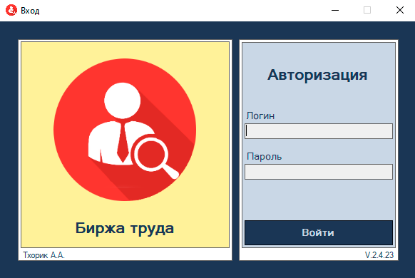

<h1 align="center">Биржа труда</a> 
<h2 align="center">Курсовой проект</h2>
 

Автоматизированная система деятельности биржы труда. Построена на архитектуре MVP. Основная часть работы проведена со стороны сервера PostgreSQL.

Легкий клиент имеет следующий функционал:

<ul>
 <li>Авторизация при помощи логина и пароля</li>
 <li>Просмотр системных таблиц (администратор)</li>
 <li>Просмотр всех таблиц (все пользователи)</li>
 <li>Удаление записей (администратор)</li>
 <li>Обновление записей (администратор)</li>
 <li>Добавление записей (администратор)</li>
</ul>

<h3 align="center">Форма авторизации</h3>

